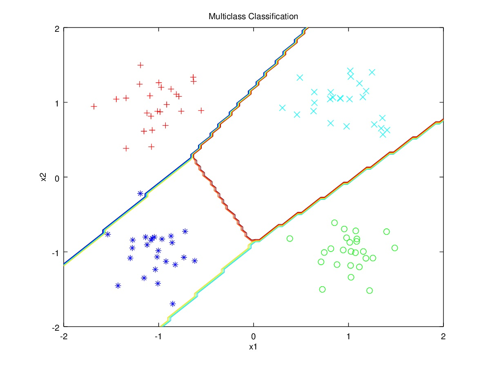
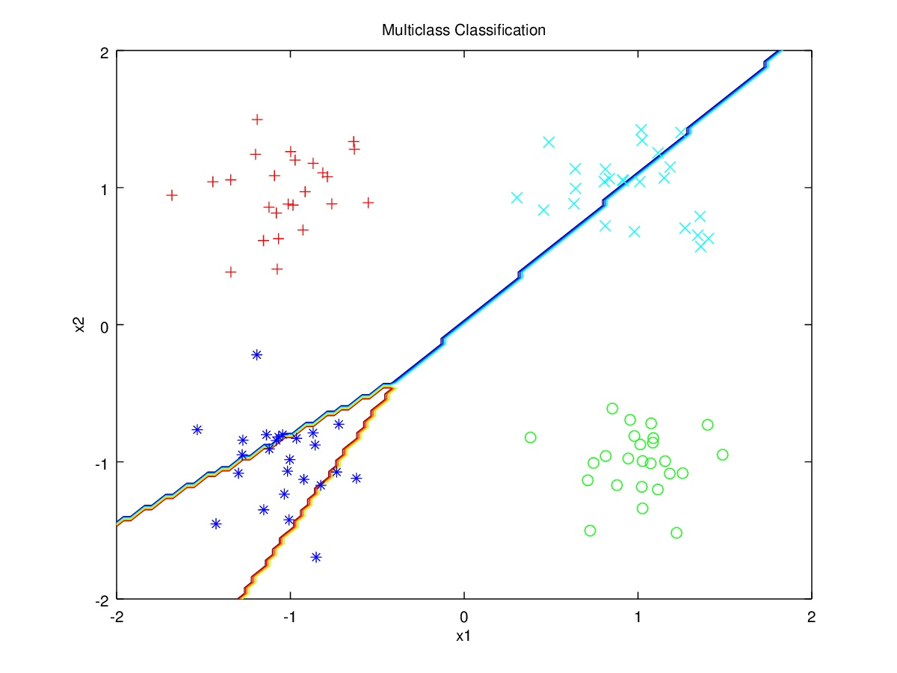

---
title: 'CS281A Problem Set #3'
author: "Juanyan Li"
date: "Oct 2015"
output: pdf_document
---

#1. Multiclass Classification

##(a) Logistic regression

###i. log likelihood and derivatives

$$
l(\beta|\mathcal{D}) = \sum_{n=1}^N\sum_{k=1}^Ky_n^klog\mu_n^k
$$

First derivative:

$$
\nabla_{\beta_i}l = \sum_{n=1}^N(y_n^i-\mu_n^i)x_n
$$

Second derivative:
$$
\nabla_{\beta_i}^2l = -\sum_{n=1}^N x_n^2\mu_n^i(1-\mu_n^i)
$$

where for $k=1,...,K-1$

$$
\mu_n^k = p(Y^k=1|x,\beta) = \frac{exp(-\beta_k^T x_n)}{1+\sum_{i=1}^{K-1}exp(-\beta_i^{T}x_n)} 
$$

$$
\mu_n^K = 1 - \sum_{i=1}^{K-1} \mu_n^k
$$

###ii. pseudo code of Newton-Raphson algorithm

Initialize($\beta,X,y$)

for $i$ = steps

&nbsp;&nbsp;&nbsp;&nbsp;$\beta$ = NR_algorithm($X,y,\beta$)
  
end

NR_algorithm($X,y,\beta$)

&nbsp;&nbsp;&nbsp;&nbsp;for $i$ = 1 : numberOfClasses
  
&nbsp;&nbsp;&nbsp;&nbsp;&nbsp;&nbsp;&nbsp;&nbsp;$\mu_i^{(t)}$ = Compute_mu()

&nbsp;&nbsp;&nbsp;&nbsp;&nbsp;&nbsp;&nbsp;&nbsp;$\eta_i$ = Compute_eta()
    
&nbsp;&nbsp;&nbsp;&nbsp;&nbsp;&nbsp;&nbsp;&nbsp;$z_i^{(t)} = \eta_{i}+[W_i]^{-1}(y_i-\mu_i^{(t)}$)
    
&nbsp;&nbsp;&nbsp;&nbsp;&nbsp;&nbsp;&nbsp;&nbsp;$W = diag(\mu(1-\mu))$

&nbsp;&nbsp;&nbsp;&nbsp;&nbsp;&nbsp;&nbsp;&nbsp;$\beta_i^{(t+1)} = (X^{T}W_i^{(t)}X )^{-1}X^{T}W_i^{(t)}z_i^{(t)}$

&nbsp;&nbsp;&nbsp;&nbsp;end

&nbsp;&nbsp;&nbsp;&nbsp;return($\beta$)

##(b) Linear model

Given the spherical case, we have:

$$
p(y|X=x,\beta) = (2\pi)^{-\frac{k}{2}}exp\{-\frac{1}{2}(y-\beta^{T}x)^T(y-\beta^{T}x)\}
$$

Maximizing likelihood:

$$
arg\,max\,exp\{-\frac{1}{2}(y-\beta^{T}x)^T(y-\beta^{T}x)\}
$$

We use normal equation to get to optimal $\beta$ since the number of observations is small:

$$
\beta = (X^{T}X)^{-1}X^{T}y
$$

#2. Comparison of multiclass classifiers

Both (a) & (b) are implemented on Octave 4.0.0

##(a) Logistics regression model in 1(a)

The misclassification rate for logistic regression model are as follows:

Training set:

    The misclassification rate on dataset is: 8.18182%
    
Testing set:

    The misclassification rate on dataset is: 18.1818%

##(b) Linear regression model in 1(b)

The misclassification rate for linear regression model are as follows:

Training set:

    The misclassification rate on dataset is: 22.7273%

Testing set:

    The misclassification rate on dataset is: 29.0909%
    

##(c) Because logistic regression uses sigmoid function to model event probability, it is less sensitive to ourliers than linear regression, which is affected heavily by abnormal data points in the training set. 
 
#3. Exponential Family

##(a) Geometric

$$p(k;p) = (1-p)^{k} = exp\{klog(1-p)+logp\}$$

$$\eta = log(1-p)$$

$$p = 1 - e^{\eta}$$

$$A(\eta) = -log(1-e^{\eta})$$

$$T(k) = k$$

$$h(k) = 1$$

##(b) Pareto

$$p(x;x_m,\alpha) = \frac{\alpha x_m^{\alpha}}{x^{\alpha+1}}1[x\geq x_m]$$

With $x_m$ fixed, the Pareto distribution is an exponential family

$$p(x;\alpha) = exp\{log\alpha + \alpha log x_m - (\alpha +1)logx\}$$

$$\eta = -(\alpha + 1)$$

$$A(\eta) = -log\alpha(\eta)-\alpha(\eta)logx_m = -log(-\eta-1)+(\eta+1)logx_m$$

$$h(x) = 1$$

##(c) Inverse Gaussian

$$
\begin{aligned}
p(x;\lambda, \mu) &= exp\{\frac{1}{2}log(\frac{\lambda}{2\pi x^3})-\frac{\lambda(x-\mu)^2}{2\mu^2 x}\} \\
 & = (\frac{1}{2\pi x^3})^\frac{1}{2} exp\{-\frac{\lambda}{2\mu^2}x-\frac{\lambda}{2x}+\frac{\lambda}{\mu}+\frac{1}{2}log\lambda\}
\end{aligned}
$$

$$
\eta = \begin{bmatrix}
    -\frac{\lambda}{2\mu^2} \\
    -\frac{\lambda}{2}\\
\end{bmatrix}
$$

$$
T(x) = \begin{bmatrix}
    x \\
    \frac{1}{x}\\
\end{bmatrix}
$$

$$
A(\eta) = -\frac{1}{2}log(-2\eta_2)-2\sqrt{\eta_1\eta_2}
$$

$$
h(x) = (\frac{1}{2\pi x^3})^{\frac{1}{2}}
$$

##(d) Weibull

With fixed k, Weibull distribution belongs to the exponential family:

$$p(x;\lambda)=exp\{log\frac{k}{\lambda}+(k-1)logx-(k-1)log\lambda-(\frac{x}{\lambda})^k\}1[x\geq 0]$$

$$\eta = -\frac{1}{\lambda^k}$$

$$T(x) = kx^k$$

$$h(x) = x^{k-1}$$

$$A(\eta) = klog\lambda = log(-\frac{1}{\eta})$$

#4. Deviation inequalities

##(a) First:

$$logPr(X\geq t) \leq A(\eta) - \eta t$$

The inequality above is the same as:

$$
Pr(X\geq t) \leq exp\{A(\eta) - \eta t\} = \frac{e^{A(\eta)}}{e^{\eta t}} = \frac{\mathbb{E}e^{\eta X}}{\eta^{\eta t}}
$$

Since

$$
\begin{aligned}
\mathbb{E}e^{\eta X} &= \int_{0}^{\infty}e^{\eta X}f(x)dx \\
&\geq \int_{t}^{\infty}e^{\eta X}f(x)dx \\
&\geq e^{\eta X}\int_{t}^{\infty}f(x)dx \\
&= e^{\eta X}Pr(X \geq t)
\end{aligned}
$$

We have the deviation inequality:

$$
Pr(X\geq t) = \frac{\mathbb{E}e^{\eta X}}{\eta^{\eta t}} \leq exp\{A(\eta) - \eta t\}
$$

##(b) Second: 

$$Pr(X \geq \mathbb{E}X + \epsilon) \leq exp(-\frac{2\epsilon^2}{(b-a)^2})$$

Given that:
$$
A(\eta) = log\mathbb{E}e^{\eta X}
$$

$$
\begin{aligned}
\frac{\partial A(\eta)}{\partial \eta} &= \frac{\mathbb{E}(Xe^{\eta X})}{\mathbb{E}e^{\eta X}} \\
\nabla A(0) &= \mathbb{E}X
\end{aligned}
$$

Moreover, the *Popoviciu's inequality* gives an upper bound of the variance of a bounded probability distribution. Since $p(y)$ belongs to exponential family and is canonical, $\nabla^2 A(\xi)$ is the variance of some bounded random variable $Y_{\eta}$, we have:

$$
\nabla^2 A(\xi) =  Var(Y_{\eta}) \leq \frac{(b-a)^2}{4} 
$$

According to (a):

$$Pr(X \geq \mathbb{E}X + \epsilon) \leq exp\{A(\eta)-\eta (\mathbb{E}X+\epsilon)\}$$

where

$$
\begin{aligned}
exp(A(\eta)-\eta (\mathbb{E}X+\epsilon)) &= exp\{\eta \nabla A(0) + \frac{\eta^2}{2}\nabla^2 A(\xi) - \eta(\mathbb{E}X+\epsilon)\} \\
& = exp\{\eta \nabla A(0) + \frac{\eta^2}{2}\nabla^2 A(\xi) - \eta \nabla A(0) - \eta \epsilon\} \\
& = exp\{\frac{\eta^2}{2}\nabla^2 A(\xi)-\eta \epsilon\} \\
&\leq exp\{\frac{\eta^2 (b-a)^2}{8}-\eta \epsilon\}
\end{aligned}
$$

In order to get the desired inequality, the formula mentioned above has to satisfy:

$$
\begin{aligned}
\frac{\eta^2 (b-a)^2}{8}-\eta \epsilon\ \leq -\frac{2\epsilon^2}{(b-a)^2} \\
\frac{\eta^2 (b-a)^4}{8(b-a)^2} - \frac{8\eta \epsilon (b-a)^2}{8(b-a)^2} \leq -\frac{16\epsilon^2}{8(b-a)^2} \\ 
\eta^2 (b-a)^4 - 8\eta \epsilon (b-a)^2 \leq -16\epsilon^2 \\
16\epsilon^2 - 8\eta \epsilon (b-a)^2 + \eta^2 (b-a)^4 \leq 0 \\
[4\epsilon - \eta (b-a)^2] \leq 0
\end{aligned}
$$

Hence, for 
$$\epsilon = \frac{\eta (b-a)^2}{4} > 0$$

We have the inequality:
$$Pr(X \geq \mathbb{E}X + \epsilon) \leq exp(-\frac{2\epsilon^2}{(b-a)^2})$$

