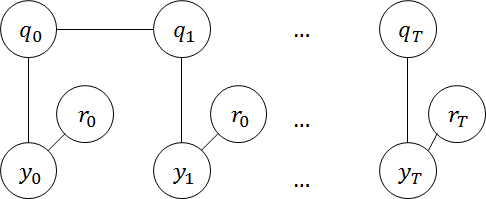

#HMMs with mixtures of Poissons

##a. Graphical model

The graphical model for HMM with mixtures of Poissons looks like this:

##b. Expected complete log likelihood

$$
\log{p(q,r,y)} = \sum_{i=1}^m q_{0}^{i} \log{\pi_i} + \sum_{t=0}^{T-1}\sum_{i=1}^{m}\sum_{j=1}^{m}q_{t}^{i}q_{t+1}^{j}\log{a_{ij}}+\sum_{t=0}^{T}\sum_{i=1}^{m}\sum_{j=1}^{k}y_{t}q_{t}^{i}r_{t}^{j}\log{\lambda_{ij}}+[\lambda_{ij}]^{q_{t}^{i}r_{t}^{j}}-\log{y_{t}!}
$$

Sufficient statistic for $a_{ij}$ is $m_{ij}\overset{\Delta}{=}\sum_{t=0}^{T-1}q_{t}^{i}q_{t+1}^{j}$; sufficient statistic for $\lambda_{ij}$ is $n_{ij}\overset{\Delta}{=}\sum_{t=0}^{T}y_{t}q_{t}^{i}r_{t}^{j}$; sufficient statistic for $\pi_{i}$ is $q_{0}^i$.

The maximum likelihood estimates for the case of complete data are therefore given by:

$$
\begin{aligned}
&\hat{a_{ij}} = \frac{m_{ij}}{\sum_{s=1}^{m}m_{is}}\\
&\hat{\pi_{ij}} = q_{0}^{i}\\
&\hat{\lambda_{ij}} = \frac{n_{ij}}{\sum_{s=1}^{k}n_{is}}
\end{aligned}
$$

Parameters of the mdoel are defined as $\theta \overset{\Delta}{=} (\pi,A,\lambda)$. The expectations for E step is given by:

$$
\begin{aligned}
&E(m_{ij}|y,\theta^{(p)}) = \sum_{t=0}^{T-1}p(q_{t}^{i}q_{t+1}^{j}|y,\theta^{(p)}) \overset{\Delta}{=}\sum_{t=0}^{T-1}\xi_{t,t+1}^{ij} \\
&E(n_{ij}|y,\theta^{(p)})=\sum_{t=0}^{T}y_{t}r_{t}^{j}p(q_{t}^{i}|y,\theta^{(p)}) \overset{\Delta}{=}\sum_{t=0}^{T}\gamma_{t}^{i}r_{t}^{j}y_{t}
\end{aligned}
$$

##c. Algorithm for E step

- Forward recursion

$$
\alpha(q_{t+1}) = \sum_{q_t}\alpha(q_t)a_{q_{t},q_{t+1}}p(y_{t+1}|q_{t+1})
$$

Initialization of $\alpha(q_0)$ is given by:

$$
\alpha(q_0)=p(y_0|q_0)\pi_{q_0}
$$

- Backward recursion

$$
\beta(q_t) = \sum_{q_{t+1}}\beta(q_{t+1})a_{q_{t},q_{t+1}}p(y_{t+1}|q_{t+1})
$$

Initialization of $\beta(q_T)$ is no more complex than a vector of ones.

Thus, we have everything we need for the E step:

$$
\begin{aligned}
&\gamma(q_t) = \frac{\alpha(q_t)\beta(q_t)}{\sum_{q_t}\alpha(q_t)\beta(q_t)}\\
&\xi(q_{t},q_{t+1}) = \frac{\alpha(q_t)p(y_{t+1}|q_{t+1})\gamma(q_{t+1})a_{q_{t},q_{t+1}}}{\alpha(q_{t+1})}
\end{aligned}
$$

$\gamma_t^i$ is equal to $\gamma(q_t)$ evaluated at $q_t^i=1$; $\xi_{t,t+1}^{ij}$ is equal to $\xi(q_t,q_{t+1})$ evaluated at $q_t^i=1, q_{t+1}^j=1$.

##d. Algorithm for M step

After the calculation of E step, updates in M step are given by:

$$
\begin{aligned}
&\hat{\lambda}_{ij}^{(p+1)} = \frac{\sum_{t=0}^{T}\gamma_{t}^{i}r_{t}^{j}y_t}{\sum_{t=0}^{T}\gamma_{t}^{i}y_t}\\
&\hat{a}_{ij}^{(p+1)} = \frac{\sum_{t=0}^{T-1}\xi_{t,t+1}^{ij}}{\sum_{t=0}^{T-1}\gamma_t^i}\\
&\hat{\pi}_{i}^{(p+1)} = \gamma_0^i 
\end{aligned}
$$

